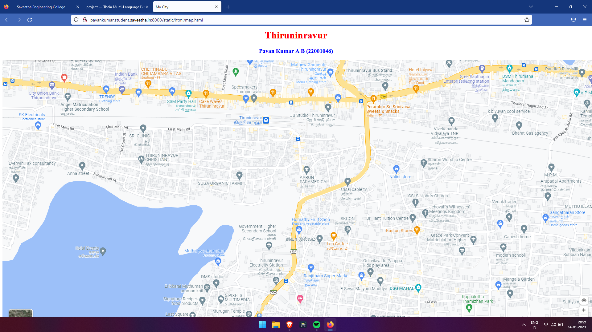
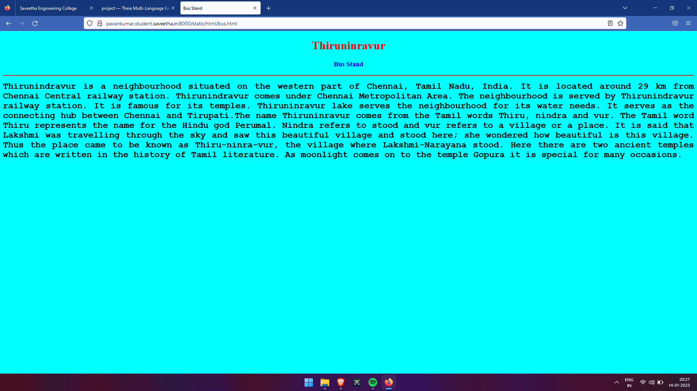
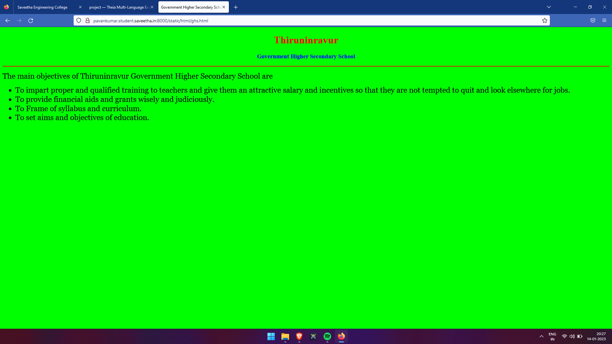
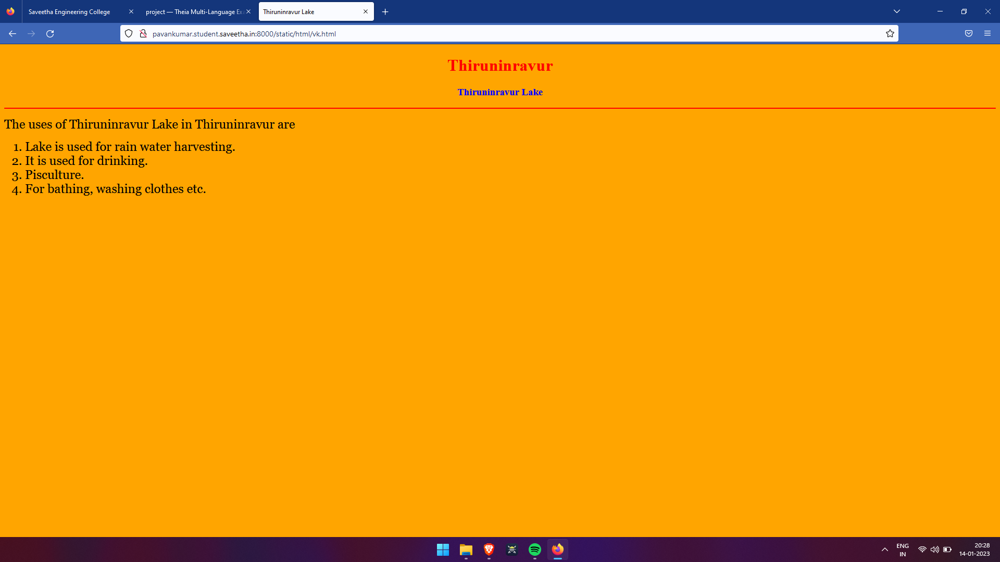
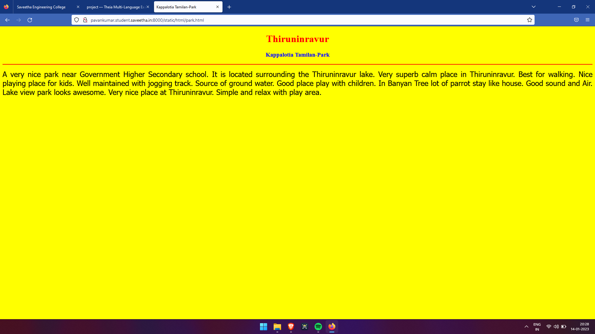
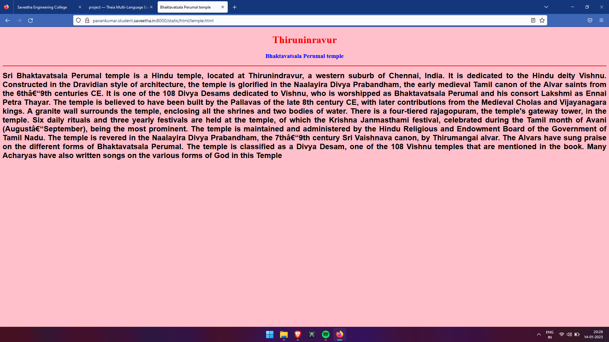

# Places Around Me
## AIM:
To develop a website to display details about the places around my house.

## Design Steps:

### Step 1:
Fork and Clone the GitHub repository.

### Step 2:
Create a new Django project.

### Step 3:
write the needed html code.

### Step 4:
Run the Django server and execute the HTML files.
## Code:
```
map.html

<!DOCTYPE html>
<html lang="en">
<head>
<title>My City</title>
</head>
<body>
<h1 align="center">
<font color="red"><b>Thiruninravur</b></font>
</h1>
<h3 align="center">
<font color="blue"><b>Pavan Kumar A B (22001046)</b></font>
</h3>
<center>

<map name="MyCity">
<area shape="circle" coords="830,550,120" href="/static/html/ghs.html" title="Government Higher Secondary School">
<area shape="circle" coords="800,820,100" href="/static/html/temple.html" title="Bhaktavatsala Perumal temple">
<area shape="circle" coords="300,700,250" href="/static/html/vk.html" title="Thiruninravur Lake">
<area shape="circle" coords="1200,50,90" href="/static/html/bus.html" title="Bus Stand">
<area shape="circle" coords="1500,800,100" href="/static/html/park.html" title="Kappalotia Tamilan-Park">
</map>
</center>
</body>
</html>

bus.html

<!DOCTYPE html>
<html lang="en">
<head>
<title>Bus Stand</title>
</head>
<body bgcolor="cyan">
<h1 align="center">
<font color="red"><b>Thiruninravur</b></font>
</h1>
<h3 align="center">
<font color="blue"><b>Bus Stand</b></font>
</h3>
<hr size="3" color="red">
<p align="justify">
<font face="Courier New" size="5">
<b>
Thirunindravur is a neighbourhood situated on the western part of Chennai, Tamil Nadu, India. It is located around 29 km from Chennai Central railway station. Thirunindravur comes under Chennai Metropolitan Area. The neighbourhood is served by Thirunindravur railway station. It is famous for its temples. Thiruninravur lake serves the neighbourhood for its water needs. It serves as the connecting hub between Chennai and Tirupati.The name Thiruninravur comes from the Tamil words Thiru, nindra and vur. The Tamil word Thiru represents the name for the Hindu god Perumal. Nindra refers to stood and vur refers to a village or a place. It is said that Lakshmi was travelling through the sky and saw this beautiful village and stood here; she wondered how beautiful is this village. Thus the place came to be known as Thiru-ninra-vur, the village where Lakshmi-Narayana stood. Here there are two ancient temples which are written in the history of Tamil literature. As moonlight comes on to the temple Gopura it is special for many occasions.
</b>
</font>
</p>
</body>
</html>

ghs.html

<!DOCTYPE html>
<html lang="en">
<head>
<title>Government Higher Secondary School</title>
</head>
<body bgcolor="lime">
<h1 align="center">
<font color="red"><b>Thiruninravur</b></font>
</h1>
<h3 align="center">
<font color="blue"><b>Government Higher Secondary School</b></font>
</h3>
<hr size="3" color="red">
<p align="justify">
<font face="Georgia" size="5">
The main objectives of Thiruninravur Government Higher Secondary School are 
<ul>
<li>To impart proper and qualified training to teachers and give them an attractive salary and incentives so that they are not tempted to quit and look elsewhere for jobs.</li>
<li>To provide financial aids and grants wisely and judiciously.</li>
<li>To Frame of syllabus and curriculum.</li>
<li>To set aims and objectives of education.</li>
</ul>
</font>
</p>
</body>
</html>

park.html

<!DOCTYPE html>
<html lang="en">
<head>
<title>Kappalotia Tamilan-Park</title>
</head>
<body bgcolor="yellow">
<h1 align="center">
<font color="red"><b>Thiruninravur</b></font>
</h1>
<h3 align="center">
<font color="blue"><b>Kappalotia Tamilan-Park</b></font>
</h3>
<hr size="3" color="red">
<p align="justify">
<font face="Tahoma" size="5">
A very nice park near Government Higher Secondary school. It is located surrounding the Thiruninravur lake. 
Very superb calm place in Thiruninravur. Best for walking. Nice playing place for kids.
Well maintained with jogging track. Source of ground water.
Good place play with children.  In Banyan Tree lot of parrot stay like house. 
Good sound and Air. Lake view park looks awesome.
Very nice place at Thiruninravur.
Simple and relax with play area.
</font>
</p>
</body>
</html>

temple.html

<!DOCTYPE html>
<html lang="en">
<head>
<title>Bhaktavatsala Perumal temple</title>
</head>
<body bgcolor="pink">
<h1 align="center">
<font color="red"><b>Thiruninravur</b></font>
</h1>
<h3 align="center">
<font color="blue"><b>Bhaktavatsala Perumal temple</b></font>
</h3>
<hr size="3" color="red">
<p align="justify">
<font face="Arial" size="5">
<b>
Sri Bhaktavatsala Perumal temple is a Hindu temple, located at Thirunindravur, a western suburb of Chennai, India. It is dedicated to the Hindu deity Vishnu. Constructed in the Dravidian style of architecture, the temple is glorified in the Naalayira Divya Prabandham, the early medieval Tamil canon of the Alvar saints from the 6th–9th centuries CE. It is one of the 108 Divya Desams dedicated to Vishnu, who is worshipped as Bhaktavatsala Perumal and his consort Lakshmi as Ennai Petra Thayar.
The temple is believed to have been built by the Pallavas of the late 8th century CE, with later contributions from the Medieval Cholas and Vijayanagara kings. A granite wall surrounds the temple, enclosing all the shrines and two bodies of water. There is a four-tiered rajagopuram, the temple's gateway tower, in the temple.
Six daily rituals and three yearly festivals are held at the temple, of which the Krishna Janmasthami festival, celebrated during the Tamil month of Avani (August–September), being the most prominent. The temple is maintained and administered by the Hindu Religious and Endowment Board of the Government of Tamil Nadu.
The temple is revered in the Naalayira Divya Prabandham, the 7th–9th century Sri Vaishnava canon, by Thirumangai alvar. The Alvars have sung praise on the different forms of Bhaktavatsala Perumal. The temple is classified as a Divya Desam, one of the 108 Vishnu temples that are mentioned in the book. Many Acharyas have also written songs on the various forms of God in this Temple
</b>
</font>
</p>
</body>
</html>

vk.html

<!DOCTYPE html>
<html lang="en">
<head>
<title>Thiruninravur Lake</title>
</head>
<body bgcolor="orange">
<h1 align="center">
<font color="red"><b>Thiruninravur</b></font>
</h1>
<h3 align="center">
<font color="blue"><b>Thiruninravur Lake</b></font>
</h3>
<hr size="3" color="red">
<p align="justify">
<font face="Georgia" size="5">
The uses of Thiruninravur Lake in Thiruninravur are 
<ol type="1">
<li>Lake is used for rain water harvesting.</li>
<li>It is used for drinking.</li>
<li>Pisculture.</li>
<li>For bathing, washing clothes etc.</li>
</ol>
</font>
</p>
</body>
</html>
```

## Output:












## HTML Validator

## Result:
The program for implementing image map is executed successfully.